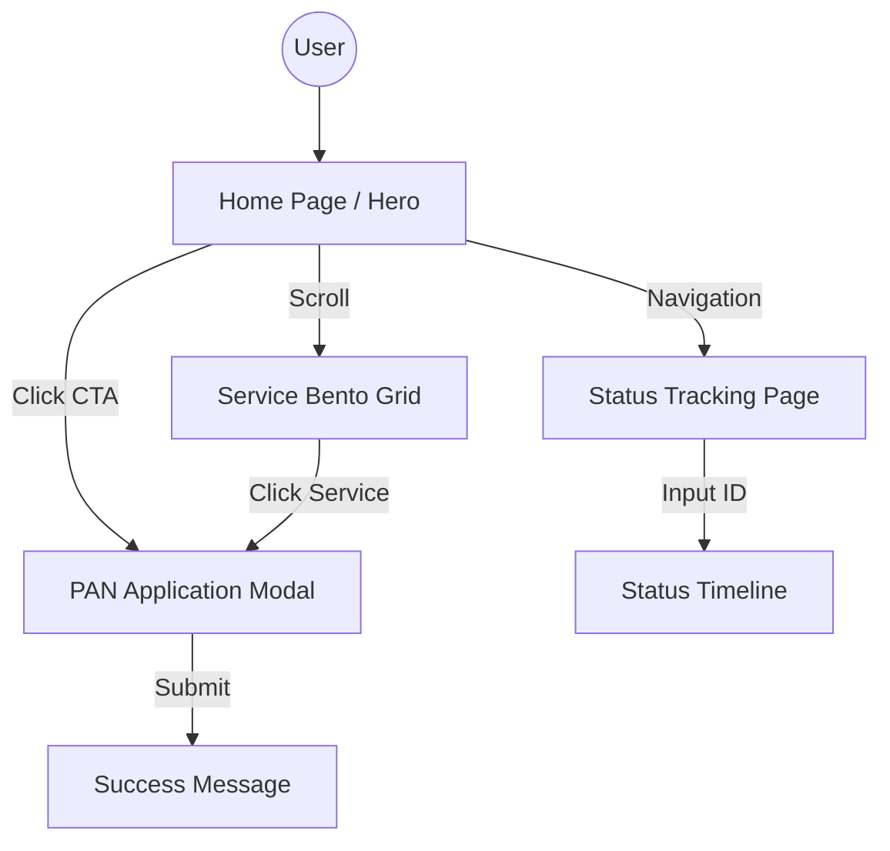

# 🏛 Technical Architecture - Gazi Online

## 🗺️ System Flow

## 🎨 Design Tokens

| Token | Value | Hex |
|-------|-------|-----|
| Navy 900 | Deep Authority | #0A1045 |
| Emerald 500 | Action/Success | #00E676 |
| Glass White | Frosted Surface | rgba(255, 255, 255, 0.85) |

## 🏗️ Folder Structure

- `src/app`: Routes and Page layouts (Next.js 14).
- `src/components`: Reusable UI components (Hero, Bento Grid, Workflow).
- `src/lib`: Utilities (Logger).
- `public`: Static assets (Logos, OG Images).
